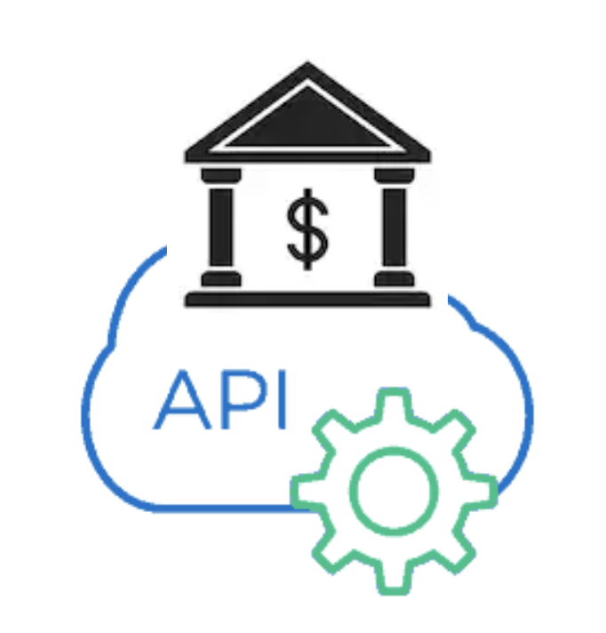
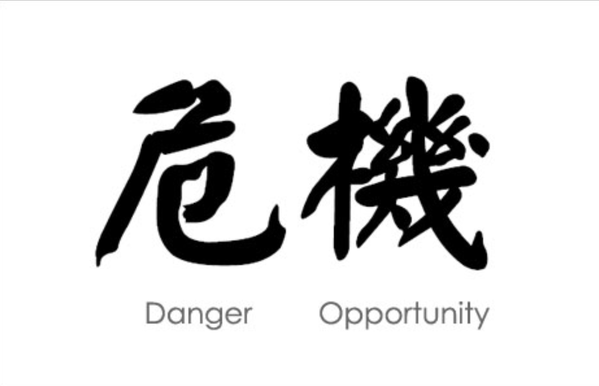

footer: JFUTURE 2019
slidenumbers: true

# Hey Google, send 20\$ to Mummy!?

### An introduction to voice assistants and banking APIs

---

# December 2018

---

# Side Projects

---

# INTERNET OF STUFF

---

# And using your voice!

---

# This talk

---

# This talk

---

# PSD2 : Cryptic name, simple idea

---

# PSD2 : Cryptic name, simple idea

The Payment Services Directive[1] (PSD, Directive 2007/64/EC, replaced by PSD2, Directive (EU) 2015/2366) is an EU Directive, administered by the European Commission (Directorate General Internal Market) to regulate payment services and payment service providers throughout the European Union (EU) and European Economic Area (EEA). The Directive's purpose was to increase pan-European competition and participation in the payments industry also from non-banks, and to provide for a level playing field by harmonizing consumer protection and the rights and obligations for payment providers and users.[2]

---

# PSD2 : Cryptic name, simple idea

- 14 September 2019
- Increase competition
- Increase participation non-bank industries
- Harmonize customer protection rights and obligation

---

# 3 big APIs

**Account Information Services**

Overview of your bank accounts and payments

---

# 3 big APIs

**Confirmation of Available Funds**

- Can I actually buy this car right now

---

# 3 big APIs

**Payment Initiation Services**

- Execute payment on your behalf (Alternative to Card Payment)

---

# 2 use cases :

- What was my last transaction?
- Send money to one of my contacts!

---

# Generics about voice assistants

---

## Vocabulary:

- **Action**: 'App'. Something Assistant can do
- **Intent** : User request. What does the user want
- **Context** : Where is the user at in his conversation ?
- **Fulfillment** : What are we gonna do? What's happening.

---

## Intent

There can be several ways to request!

polite, question, assertive, short, specific, generic, ...

---

## Entities

Parts of the **intent** needed to fulfill it

Size, type, options, amount, person, location, ….

Can also help personalize

---

# Demo time!

---

# Our goal

- Hey Google, Send 20\$ to my mum using My Money Agent.
- Hey Google, what was my last transaction?

---

# How it looks like

Draw architecture here

---

# Final thoughts

---

# Voice assistants: Who's listening?

[Google exec says you should warn guests about your spy speakers](https://www.zdnet.com/article/google-exec-says-you-should-warn-guests-about-your-spy-speakers/)

---

# Voice assistants : security

[Dolphin attack](https://mashable.com/2018/05/10/hidden-commands-digital-assistants-dolphin-attack/?europe=true)

---

# PSD2 : Danger of opportunity?

---

# Would You Like To Know More?

- [PSD2](https://en.wikipedia.org/wiki/Payment_Services_Directive)
- [ING PSD2](https://developer.ing.com/openbanking/get-started)
- [Open Bank Project](https://www.openbankproject.com/)
- [Dialogflow](https://cloud.google.com/dialogflow/docs/)

---

# This talk

- [Project](https://github.com/jlengrand/dialogflow-fun)
- [Slides](https://github.com/jlengrand/dialogflow-fun)

---

# Questions?

- [Twitter](https://twitter.com/jlengrand)

Thanks!

---

Need architecture
