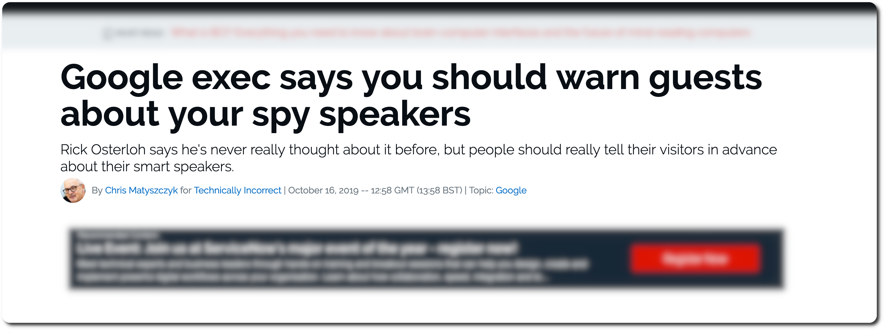
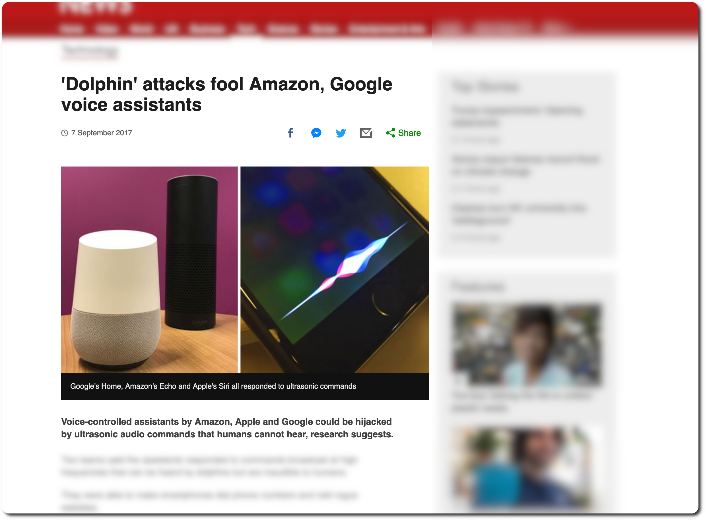

footer: 
slidenumbers: true

# Hey Google, send 20\$ to Mum!?

### An introduction to voice assistants and banking APIs

---

# December 2018

---

# Side Projects

---

# Side Projects

---

# INTERNET OF STUFF

---

# And using your voice!

---

# This talk
---

---

---

# PSD2 : In short

---

The Payment Services Directive[1] (PSD, Directive 2007/64/EC, replaced by PSD2, Directive (EU) 2015/2366) is an EU Directive, administered by the European Commission (Directorate General Internal Market) to regulate payment services and payment service providers throughout the European Union (EU) and European Economic Area (EEA). The Directive's purpose was to increase pan-European competition and participation in the payments industry also from non-banks, and to provide for a level playing field by harmonizing consumer protection and the rights and obligations for payment providers and users.[2]

---

# PSD2 : Cryptic name, simple idea

- 14 September 2019
- Increase competition
- Increase participation non-bank industries
- Harmonize customer protection rights and obligation

---

# 3 big APIs
---

## Account Information Services

### Overview of your bank accounts and payments

---

## Confirmation of Available Funds

### Can I actually buy this car right now?

---

## Payment Initiation Services

### Execute payment on your behalf (Alternative to Paypal)

---

# Generics about voice assistants

---

## Vocabulary:

- **Action**: 'App'. Something Assistant can do
- **Intent** : User request. What does the user want
- **Context** : Where is the user at in his conversation ?
- **Fulfillment** : What are we gonna do? What's happening.

---

# Entities

- Parts of the **intent** needed to fulfill it
- Size, type, options, amount, person, location, …
- Can also help personalize the experience

---

# Demo time!

---

# Our goal

- Hey Google, what was my last transaction?
- Hey Google, Send 20\$ to my mum using My Money Agent.

---

# How it looks like

---

# Final thoughts

---

# Voice assistants: Who's listening?

[Apparently someone is](https://www.zdnet.com/article/google-exec-says-you-should-warn-guests-about-your-spy-speakers/)

---

# Voice assistants : security

[Dolphin attacks are a thing](https://www.bbc.com/news/technology-41188557)

---

# PSD2 : Danger of opportunity?

---

# Would You Like To Know More?

- [PSD2](https://en.wikipedia.org/wiki/Payment_Services_Directive)
- [Open Bank Project](https://www.openbankproject.com/)
- [Dialogflow](https://cloud.google.com/dialogflow/docs/)

---

# Would You Like To Know More?

- [Code for this project](https://github.com/jlengrand/dialogflow-fun)
- [Slides](https://github.com/jlengrand/google-send-money-talk)

---

# Thanks!

##  
##  [@jlengrand](https://twitter.com/jlengrand) and [Github](https://github.com/jlengrand/)

---

## Intent

There can be several ways to request!

polite, question, assertive, short, specific, generic, ...